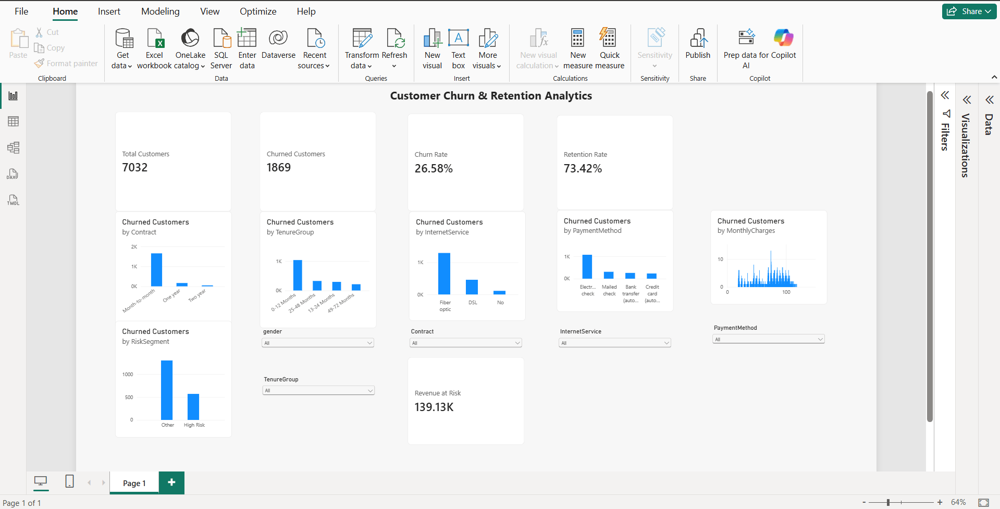

# Customer Churn & Retention Analytics

End-to-end customer churn and retention analysis using Python, SQL, and Power BI to identify churn drivers, high-risk customer segments, and revenue impact.

## 📊 Dashboard



## 🎯 Project Objective

The objective of this project is to analyze customer churn patterns, identify high-risk customer segments, and understand the potential revenue impact of customer attrition.

## 🛠️ Tools & Technologies

- Python
- Google Colab
- Pandas
- NumPy
- Matplotlib
- Seaborn
- SQL
- Power BI
- GitHub

## 📁 Project Structure

```text
Customer-Churn-Retention-Analytics/
│
├── data/
│   ├── telco_customer_churn.csv
│   └── customer_churn_cleaned.csv
│
├── notebooks/
│   └── Customer_Churn_Analysis.ipynb
│
├── sql/
│   └── churn_analysis.sql
│
├── powerbi/
│   └── customer_churn_dashboard.pbix
│
├── images/
│   └── dashboard.png
│
├── README.md
├── requirements.txt
└── .gitignore
